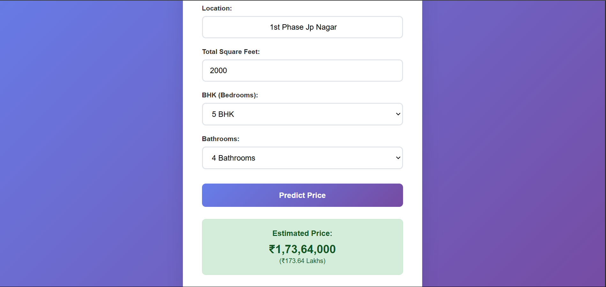

# 🏠 Bengaluru Home Price Predictor

A machine learning-powered web application that predicts home prices in Bengaluru based on location, size, and other key features. Built with Python Flask backend and vanilla JavaScript frontend.

## 🌟 Features

- **Interactive Location Search**: Smart dropdown with searchable location names
- **Real-time Price Prediction**: Get instant price estimates based on your inputs
- **Responsive Design**: Modern, mobile-friendly interface
- **240+ Locations**: Covers major areas across Bengaluru
- **Machine Learning Model**: Uses Linear Regression trained on real estate data

## 🚀 Demo

The application provides estimated home prices in Bengaluru based on:
- **Location**: Choose from 240+ areas in Bengaluru
- **Total Square Feet**: Property size
- **BHK**: Number of bedrooms (1-5)
- **Bathrooms**: Number of bathrooms (1-5)

## 🛠️ Technologies Used

**Backend:**
- Python 3.x
- Flask (Web Framework)
- scikit-learn (Machine Learning)
- NumPy (Numerical Computing)
- Pickle (Model Serialization)

**Frontend:**
- HTML5
- CSS3 (Modern styling with gradients and animations)
- Vanilla JavaScript
- Responsive Design

**Machine Learning:**
- Linear Regression Model
- Feature Engineering with Location Encoding
- Trained on Bengaluru real estate dataset

## 📁 Project Structure

```
bengaluru-home-price-predictor/
├── server/
│   ├── artifacts/
│   │   ├── bengaluru_home_prices_prediction.pickle
│   │   └── columns.json
│   ├── server.py
│   └── util.py
├── client/
│   └── app.html
├── model/
│   └── [Jupyter notebooks and data files]
└── README.md
```

## 🔧 Installation & Setup

### Prerequisites
- Python 3.7 or higher
- pip package manager

### 1. Clone the Repository
```bash
git clone https://github.com/tanmmayyy/bengaluru-home-price-predictor.git
cd bengaluru-home-price-predictor
```

### 2. Install Dependencies
```bash
pip install flask numpy scikit-learn
```

### 3. Start the Flask Server
```bash
cd server
python server.py
```

The server will start on `http://127.0.0.1:5000`

### 4. Open the Web Application
- Open `client/app.html` in your web browser
- Or serve it through a local web server for better performance

## 📡 API Endpoints

### Get Location Names
```http
GET /get_location_names
```
Returns a list of all available locations in Bengaluru.

**Response:**
```json
{
  "locations": ["1st Block Jayanagar", "1st Phase JP Nagar", ...]
}
```

### Predict Home Price
```http
POST /predict_home_price
```

**Parameters:**
- `location` (string): Area name in Bengaluru
- `total_sqft` (float): Total square feet
- `bhk` (float): Number of bedrooms
- `bath` (float): Number of bathrooms

**Response:**
```json
{
  "estimated_price": 85.75
}
```
*Price is returned in lakhs (₹)*

## 🎯 Usage Example

**Input:**
- Location: "1st Phase JP Nagar"
- Total Sqft: 1200
- BHK: 3
- Bathrooms: 2

**Output:**
- Estimated Price: ₹95.50 Lakhs

## 🧠 Model Details

- **Algorithm**: Linear Regression
- **Features**: 244 total features (location one-hot encoded + numerical features)
- **Training Data**: Historical real estate data from Bengaluru
- **Performance**: Optimized for price prediction accuracy

### Feature Engineering
- **Location Encoding**: One-hot encoding for 240+ locations
- **Numerical Features**: Square footage, BHK count, bathroom count
- **Normalization**: Applied to ensure consistent predictions

## 🚀 Deployment

### Local Development
1. Start the Flask server: `python server.py`
2. Open `app.html` in your browser
3. Ensure CORS is enabled for API calls

### Production Deployment
- Deploy Flask app on platforms like Heroku, AWS, or Google Cloud
- Serve the frontend through a web server (Nginx, Apache)
- Update API endpoints in the frontend code

## 🔮 Future Enhancements

- [ ] Add more features (property age, amenities, nearby facilities)
- [ ] Implement advanced ML models (Random Forest, XGBoost)
- [ ] Add price trend analysis and charts
- [ ] Include property images and descriptions
- [ ] Implement user authentication and saved searches
- [ ] Add mobile app version

## 🤝 Contributing

1. Fork the repository
2. Create a feature branch (`git checkout -b feature/AmazingFeature`)
3. Commit your changes (`git commit -m 'Add some AmazingFeature'`)
4. Push to the branch (`git push origin feature/AmazingFeature`)
5. Open a Pull Request

## 📄 License

This project is licensed under the MIT License - see the [LICENSE](LICENSE) file for details.

## 👥 Author

**Your Name**
- GitHub: [@tanmmayyy](https://github.com/tanmmayyy)
- LinkedIn: [Your LinkedIn](https://linkedin.com/in/yourprofile)

## 🙏 Acknowledgments

- Bengaluru real estate data providers
- scikit-learn community for ML tools
- Flask community for the web framework

## 📊 Screenshots



---

⭐ **If you found this project helpful, please give it a star!** ⭐